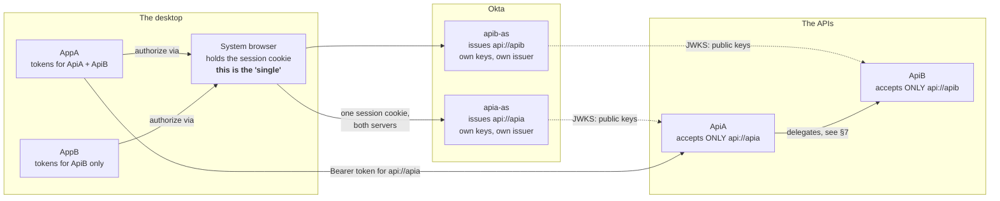
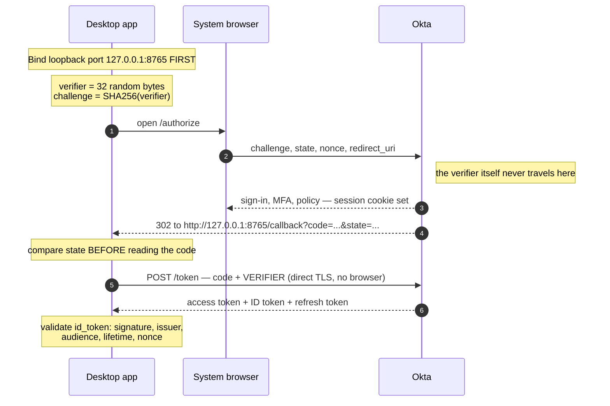
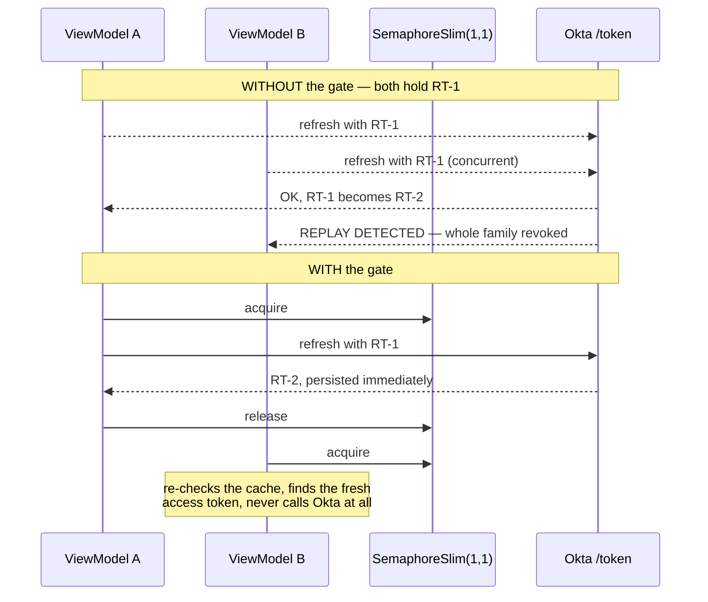
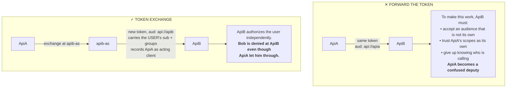

# Okta SSO for WPF — a guide from zero

Everything behind the two desktop apps and two APIs in this repository: how the protocol
actually works, how to stand it up from nothing, and which tempting shortcuts quietly destroy
the security properties you were trying to buy.

**Audience:** .NET developers new to OAuth 2.0 and OpenID Connect.
**Companions:** [`README.md`](README.md) (full reference specification), [`DEMO.md`](DEMO.md) (runnable walkthrough).

> [!NOTE]
> `README.md` is a 3,800-line reference. It is excellent for depth, but **sections 8.2 onward
> still describe an earlier implementation** built on a third-party OIDC library that has since
> been replaced. Where the two disagree, the code in `src/Corp.Identity.Core/Protocol/` is what
> runs.

---

## Contents

1. [Orientation](#1-orientation)
2. [The mental model](#2-the-mental-model)
3. [Run it in ten minutes](#3-run-it-in-ten-minutes)
4. [The sign-in flow](#4-the-sign-in-flow)
5. [Tokens at rest](#5-tokens-at-rest)
6. [The API side](#6-the-api-side)
7. [Service-to-service delegation](#7-service-to-service-delegation)
8. [Standing up a real Okta tenant](#8-standing-up-a-real-okta-tenant)
9. [What not to do](#9-what-not-to-do)
10. [Defending the design](#10-defending-the-design)
11. [References](#11-references)

---

## 1. Orientation

This guide assumes you know C# and have never configured an identity provider. By the end you
should be able to build this from scratch, explain every decision to a reviewer, and recognise
the shortcuts that turn working SSO into a security incident.

### What this repository contains

Two WPF desktop applications and two ASP.NET Core APIs, plus a local identity provider so the
whole thing runs without an Okta tenant. The shape is deliberately the awkward one: **AppA**
calls **ApiA**, ApiA needs data from **ApiB**, and ApiB sometimes needs to call back into ApiA.
That mutual call is where most real designs go wrong, so it is modelled explicitly rather than
avoided.

| Project | What it is |
|---|---|
| `Corp.Identity.Core` | The desktop auth stack. PKCE, the loopback listener, token storage, the HTTP handlers. **Microsoft packages only** — no third-party dependency. |
| `Corp.Identity.Wpf` | Dialogs, the busy overlay, focus restoration, crash reporting. WPF only, no Prism. |
| `Corp.Identity.Prism` | Optional Prism glue: the module, the navigation guard, `[RequiresScope]`. |
| `Corp.Api.Security` | Shared API-side validation and the delegation patterns. |
| `AppA`, `AppB` | The desktop clients. Deliberately thin. |
| `ApiA`, `ApiB` | The APIs that call each other, in both directions. |
| `tools/DevIdp` | A local stand-in for Okta. **Development only** — it authenticates nobody. |
| `infra/okta` | Terraform for the real tenant. |

### How to use this document

Read sections 2 and 3 before touching anything — the mental model first, then the demo, so what
you see running has somewhere to land. Sections 4–7 explain the machinery and are worth reading
with the source open beside them. Section 8 is the tenant setup you will actually perform.
Sections 9 and 10 are what you need in order to *argue* for this design, which in practice is
most of the job.

---

## 2. The mental model

Almost every SSO mistake comes from a fuzzy answer to one of three questions: who is asserting
the identity, who the assertion is *for*, and what the receiver is allowed to conclude from it.
Get these straight and the rest is configuration.

### Two protocols, two questions

OAuth 2.0 and OpenID Connect are constantly conflated, including by vendors. They answer
different questions:

- **OAuth 2.0 answers "may this software do this thing?"** It is an *authorization* framework.
  It issues access tokens, which are permission slips. An access token is not a statement about
  who a person is; it is a statement about what the bearer may do.
- **OpenID Connect answers "who is this person?"** It is a thin identity layer on top of OAuth
  2.0. It issues an ID token, which *is* a statement about a person, addressed to a specific
  application.

You need both. The desktop app needs to know who signed in, so it uses OIDC. The APIs need to
know what the caller may do, so they consume OAuth access tokens.

### The three tokens

| Token | Audience | Lifetime | What it is for |
|---|---|---|---|
| **ID token** | Your client — `appa-client` | Minutes | Proving to *your own application* who signed in. **Never send it to an API.** |
| **Access token** | An API — `api://apia` | 15 min | Presented to an API as `Authorization: Bearer`. Carries scopes and, here, group claims. |
| **Refresh token** | The authorization server | Days, rotating | Obtaining new access tokens without prompting. The only long-lived secret on the desktop. |

> [!IMPORTANT]
> **The audience rule.** A token is addressed, like an envelope. The `aud` claim names who it is
> for. An API must accept only tokens addressed to itself, and must reject everything else —
> including a perfectly valid, correctly signed token addressed to a *different* API, and
> including an ID token. This one rule prevents an entire class of privilege escalation, and it
> is one boolean away from being switched off.

### Who trusts whom

"The apps trust Okta" is not enough detail to design against. What matters is that *each API
trusts exactly one issuer*, each application holds *its own separate tokens*, and the thing that
makes sign-on "single" is neither of those — it is a cookie in the system browser.



**The three separations that matter:**

1. Each application holds its own tokens. AppA cannot read AppB's, by design.
2. Each API trusts exactly one issuer and one audience. Nothing else validates.
3. The shared thing is the browser cookie. Remove it and SSO stops; nothing else breaks.

Launching AppB after AppA is prompt-free because the browser still holds Okta's session cookie,
so the silent `prompt=none` authorize succeeds. That is the entire mechanism, and it explains
why closing every browser window can break SSO while nothing in your code changed.

### Okta's vocabulary

Okta uses terms in ways that do not always match the specs, and misreading them causes real
configuration errors.

| Term | What it means here |
|---|---|
| **Org Authorization Server** | The tenant-wide default. Cannot issue custom scopes or audiences, so it is unsuitable for protecting your own APIs. |
| **Custom Authorization Server** | What you actually use. Own issuer URL, own signing keys, own scopes, claims and access policies. Identified by an `aus…` id. |
| **Application / App integration** | A registered client. `appa-client` is a "Native" app (public, no secret); the API service identities are "Service" apps. |
| **Assignment** | A **separate gate** from policy. A user who satisfies every policy but is not *assigned* to the app gets `access_denied` — with an identical error message. Always check both. |
| **Trusted server** | Required for token exchange: server B must be told to trust tokens issued by server A. Directional, and configured per direction. |

---

## 3. Run it in ten minutes

No Okta tenant required. `tools/DevIdp` is a local authorization server that speaks the same
protocol and deliberately reproduces Okta's *shapes* — because those shapes are what break code.

```bash
dotnet run --project tools/DevIdp     # https://localhost:7100
dotnet run --project src/ApiA         # https://localhost:7201
dotnet run --project src/ApiB         # https://localhost:7202
dotnet run --project src/AppA
```

Order matters: the APIs fetch signing keys from DevIdp at startup and fail fast if it is
unreachable — deliberately, so a misconfiguration surfaces immediately rather than on the first
user request. If the browser complains about the certificate, trust the ASP.NET development
certificate once with `dotnet dev-certs https --trust`.

Sign in as **alice@contoso.com** (groups: App-Finance, App-Warehouse) or **bob@contoso.com**
(App-Warehouse only). The difference between them is what makes authorization visible.

### Five things to actually observe

1. **Identity survives a hop.** Click *Who am I? (ApiA)* and note the subject. Then click *ApiA →
   ApiB (on behalf of me)*. ApiB reports the **same subject**, but `callingClientId` is now ApiA's
   service identity. The user survived; the acting service is recorded.

2. **A service token has no user.** Click *ApiA → ApiB (service identity)*. `isServicePrincipal`
   is `true` and there is **no subject at all**. ApiB is authorizing the *service*; your
   permissions were never consulted. This is why that shape must never serve a user-initiated
   request.

3. **The downstream API does not trust the upstream one.** Sign out, sign in as **bob**, click
   *ApiA → ApiB* again. ApiA is happy to make the call; ApiB returns `403`, because the delegated
   token carries Bob's groups rather than ApiA's opinion of them.

4. **Cross-app SSO.** With AppA running, launch AppB. A browser window flashes and you are not
   prompted. AppB received its own, separate tokens — the only thing reused was the session cookie.

5. **The cycle guard.** In AppB, click *Trip the cycle guard*. Every hop is individually valid and
   nothing in OAuth stops it; a depth header does, at `508 Loop Detected`.

### Watching the flow

A WPF app has no console, but logging is wired so redirecting stdout shows the entire sign-in
sequence:

```bash
dotnet run --project src/AppA > appa.log 2>&1
```

You will see the silent authorize attempt, the `login_required` response, the interactive retry,
and the port the loopback listener bound. This is the fastest way to understand the flow, and the
fastest way to debug it later.

---

## 4. The sign-in flow

Authorization Code with PKCE, through the system browser, redirecting to a loopback port. Three
choices, each of which had a plausible-looking alternative that is wrong.



**Why this is safe without a secret:** an attacker who steals the authorization code at step 6
cannot use it at step 7. Redeeming requires the verifier, which never left the process. That is
the whole of PKCE.

### Why PKCE, concretely

A desktop application cannot keep a secret. Anything compiled into it can be extracted with a hex
editor. So it is registered as a *public client* — no secret at all — and PKCE replaces what the
secret used to do.

```csharp
// src/Corp.Identity.Core/Protocol/Pkce.cs

// 32 bytes, base64url-encoded to 43 characters. RFC 7636 allows 43–128;
// there is no benefit above 32 bytes of entropy.
public static string NewVerifier() => Base64Url(RandomNumberGenerator.GetBytes(32));

public static string Challenge(string verifier) =>
    Base64Url(SHA256.HashData(Encoding.ASCII.GetBytes(verifier)));

private static string Base64Url(byte[] bytes) =>
    Convert.ToBase64String(bytes).TrimEnd('=').Replace('+', '-').Replace('/', '_');
```

Three details go wrong routinely: the hash must be over the **ASCII** bytes of the verifier; the
encoding is base64**url**, not base64, so `+` and `/` must be substituted; and the padding `=`
must be stripped. The test suite pins this against the worked example in RFC 7636 Appendix B,
which is the cheapest possible insurance against all three.

### Why the system browser, not an embedded WebView

An embedded WebView2 would give a tidier experience: no tab left open, full control of the
window. It is the wrong choice, for three compounding reasons:

- **It has its own cookie jar.** That single fact destroys SSO. The session cookie that makes the
  second application sign in silently lives in the user's real browser. A WebView sees none of it,
  so every application prompts, every time.
- **It breaks federated login and MFA.** If your tenant federates to another IdP, or uses a
  security key or a device-trust check, those flows frequently refuse to run in an embedded control.
- **The application can read the credentials.** The host process can inspect the DOM of a WebView
  it owns — precisely the property the authorization code flow exists to avoid.

This is not a preference; it is the standing recommendation of
[RFC 8252, *OAuth 2.0 for Native Apps*](https://datatracker.ietf.org/doc/html/rfc8252), which is
short and is the single best citation when someone proposes the WebView.

### Why loopback, not a custom URI scheme

The alternative to `http://127.0.0.1:8765/callback` is registering a custom scheme like
`appa://callback`. It looks cleaner. It is a machine-global namespace.

> [!WARNING]
> **Any other installed application can register the same scheme.** On Windows the last writer
> wins, and there is no way for your application to detect it has happened or to prevent it. A
> malicious or merely careless installer can silently intercept your OAuth callback — with the
> authorization code in it. Loopback cannot be hijacked this way, because binding a port is
> exclusive and fails loudly if something else holds it.

Loopback also needs no registry writes, no elevation, and no URL ACL: `HttpListener` binds a high
port on `127.0.0.1` as the interactive user. This surprises people who assume desktop OAuth
requires an installer step. It does not.

### The details that bite

#### Bind before you build the URL

Multiple ports are registered (`8765`, `8766`, `8767`) so a second instance can still sign in.
That failover only works if the `redirect_uri` follows the port actually bound — and every
registered port must also exist in Okta's redirect URI list, or the authorize request is rejected.

```csharp
// src/Corp.Identity.Core/Protocol/LoopbackListener.cs
foreach (var port in ports)
{
    // A FRESH listener per attempt. HttpListener disposes itself when Start()
    // fails, so reusing the instance turns the second attempt into an
    // ObjectDisposedException and the failover never happens.
    var candidate = new HttpListener();
    candidate.Prefixes.Add($"http://127.0.0.1:{port}{path}/");

    try { candidate.Start(); }
    catch (HttpListenerException) { candidate.Close(); continue; }

    _listener = candidate;
    RedirectUri = $"http://127.0.0.1:{port}{path}";   // <- follows the bound port
    return;
}
```

#### Compare `state` before reading anything

The `state` parameter is your CSRF defence. It must be compared **before** the code is read out of
the query, so an unsolicited redirect is discarded rather than processed and then questioned. The
`nonce` is separate and does a different job: it binds the ID token to this specific authorize
request, so a token captured from another flow cannot be replayed into this one.

#### Validate the ID token properly

Signature, issuer, audience, lifetime **and** nonce. Audience is the one people forget, and the
one that matters most.

```csharp
// src/Corp.Identity.Core/Protocol/IdentityTokenValidator.cs
var parameters = new TokenValidationParameters
{
    ValidIssuer = configuration.Issuer,
    ValidateIssuer = true,

    // An ID token is addressed to this client, never to an API.
    ValidAudience = clientId,
    ValidateAudience = true,

    IssuerSigningKeys = configuration.SigningKeys,
    ValidateIssuerSigningKey = true,
    RequireSignedTokens = true,

    ValidateLifetime = true,
    ClockSkew = TimeSpan.FromMinutes(5),
};
```

---

## 5. Tokens at rest

The refresh token is the only long-lived credential on the desktop. How you store it, and how you
handle its rotation, is most of the desktop threat model.

### DPAPI: what it does and does not buy

Refresh tokens are encrypted with the Windows Data Protection API under the `CurrentUser` scope
and written to `%LOCALAPPDATA%\Corp\{App}\{clientId}.tokens`. Being honest about the value matters,
because overstating it leads to bad follow-on decisions.

| Protects against | Does **not** protect against |
|---|---|
| Another user on a shared machine | **Malware running as the signed-in user.** It can call `Unprotect` exactly as your code does. |
| A stolen laptop with the disk pulled | A user who deliberately extracts their own token |
| The file copied to a share, or swept into a backup | Anything with debugger rights on your process |

No in-process technique on a general-purpose desktop OS changes the right-hand column. The
controls that actually bound the damage are short access-token lifetimes, rotating refresh tokens
with reuse detection, and — as a future step — DPoP, which binds a token to a key so a stolen copy
is useless elsewhere.

Two implementation details worth copying: writes go to a temporary file and are then moved into
place, so a crash mid-write cannot leave a truncated file that forces a needless
re-authentication; and an unreadable store — roaming profile moved, machine rebuilt — is treated
as "clear and re-authenticate" rather than an error, because it is routine.

**Access tokens are never persisted.** They expire in minutes and can be re-minted silently, so
writing one to disk adds a bearer credential at rest and buys nothing.

### Rotation, and the trap it sets

With rotation enabled — and you should enable it — each refresh returns a *new* refresh token and
invalidates the old one. Presenting an already-rotated token is treated as evidence of theft, and
Okta can invalidate the entire token family.

That is a good security property and a loaded gun pointed at your own application, because a WPF
shell routinely fires several view models' loads at once on navigation.



**The double-check is not redundant.** The cache is read once before taking the gate and again
after, because a concurrent caller may have refreshed while this one waited. And the rotated token
is persisted before anything else can fail — with rotation, the old one is already dead the moment
the response arrives.

This is not defensive over-engineering. It is the difference between a working application and one
that signs users out at random, intermittently, under load — the hardest class of bug to reproduce.

### Proactive renewal, not reactive

The access-token cache treats a token as expired 90 seconds early. Renewing before expiry is
invisible; renewing after a `401` costs the user a failed request. The handler still retries once
on a `401`, because a token can be revoked or a key rotated mid-flight — but that is the exception
path, not the design.

---

## 6. The API side

Client-side checks are user experience. The API is where security actually happens, and almost all
of it is in one options block.

```csharp
// src/Corp.Api.Security/OktaAuthenticationExtensions.cs
options.Authority = okta.Issuer;
options.Audience  = okta.Audience;
options.SaveToken = true;      // needed for On-Behalf-Of later

// Keep Okta's claim names as they appear on the wire. With the default
// (true), ASP.NET Core rewrites 'sub' to a long WS-Fed URI and every
// lookup of "sub" silently returns null.
options.MapInboundClaims = false;

// Metadata carries the public keys. Over plaintext HTTP an on-path
// attacker can substitute their own.
options.RequireHttpsMetadata = true;

options.TokenValidationParameters = new()
{
    ValidateIssuer   = true,  ValidIssuer   = okta.Issuer,
    ValidateAudience = true,  ValidAudience = okta.Audience,   // <- NEVER false
    ValidateLifetime = true,
    ValidateIssuerSigningKey = true,

    // Pin the algorithm: blocks 'alg' confusion, 'none', and any attempt
    // to present a symmetric-keyed token.
    ValidAlgorithms = [SecurityAlgorithms.RsaSha256],

    ClockSkew = TimeSpan.FromSeconds(30),   // default 5 min is far too generous

    NameClaimType = "sub",
    RoleClaimType = "groups",
};
```

Four of these deserve elaboration, because each has caused real incidents.

**`MapInboundClaims = false`** — By default ASP.NET Core rewrites standard JWT claim names into
legacy WS-Federation URIs. `sub` becomes
`http://schemas.xmlsoap.org/ws/2005/05/identity/claims/nameidentifier`. Code that looks up `"sub"`
then returns `null` — silently. If that lookup was feeding an authorization decision, the decision
quietly changes.

**`ValidAlgorithms`** — Without pinning, a token declaring `"alg": "none"` or an HMAC algorithm may
be considered. The classic attack takes a public RSA key, uses it as an HMAC secret, and signs a
forged token — the library verifies with the same public key and accepts it. Pinning to `RS256`
closes the whole family of confusion attacks.

**`ClockSkew`** — The library default is five minutes. With 15-minute access tokens that is a third
of the lifetime added on. Thirty seconds is right, and requires that your API hosts actually run
NTP — a deployment requirement, not a code one.

**`ValidateAudience`** — The single most important line in the file. It stops a token minted for
ApiB, or an ID token minted for AppA, being accepted by ApiA. It is also the line most likely to be
set to `false` by someone chasing a 401 at 5pm.

### Scopes are necessary, never sufficient

A scope says what the *application* was permitted to ask for. It says nothing about which records
this user may see. Both checks are required, and they are different kinds of check:

```csharp
// Layer 1 — scope. Did the client get permission to call this at all?
[Authorize(Policy = "apia.read")]
public async Task<IActionResult> List()
{
    // Layer 2 — the user. Which of these records may THIS person see?
    var groups  = User.FindAll("groups").Select(c => c.Value).ToHashSet();
    var visible = _orders.Where(o => groups.Contains(o.OwningGroup));

    return Ok(visible);
}
```

Alice and Bob both hold `apia.read`. They see different orders. If your authorization stops at the
scope check, every user with the scope sees everything — exactly the bug the demo's Alice/Bob split
exists to make visible.

> [!WARNING]
> Put a **filtered** groups claim in the token — only the groups relevant to this application. An
> unfiltered claim in a large directory produces tokens that blow past proxy and IIS header limits,
> and it leaks your organisational structure to every API that receives one.

---

## 7. Service-to-service delegation

ApiA needs data from ApiB while serving a user's request. This is where most designs quietly lose
the user's identity, and with it every authorization decision downstream.

| Pattern | Who ApiB sees | Use when |
|---|---|---|
| **1 · On-Behalf-Of** token exchange (RFC 8693) | The user, plus ApiA as the acting party | **Default.** Any user-initiated request. |
| **2 · Client credentials** | ApiA only. No user. | Background jobs, reconciliation, anything with no user behind it. |
| **3 · Client relays** a second token | The user, via a token the desktop acquired | Only when token exchange is unavailable on your org. |
| **4 · Shared audience** | The user | Rarely. Collapses two APIs into one trust boundary. |

The tempting fifth option is to forward ApiA's own token to ApiB unchanged. It requires no new
configuration and appears to work immediately. It is the anti-pattern.



**The property being preserved:** every API makes its own authorization decision, from the user's
own claims. Forwarding destroys exactly that, which is why it cannot be a shortcut — it is a
different, weaker security model wearing the same code. The formal name is the
[confused deputy problem](https://en.wikipedia.org/wiki/Confused_deputy_problem).

### How the exchange looks on the wire

```csharp
// src/Corp.Api.Security/Delegation/OktaTokenService.cs
var form = new Dictionary<string, string>
{
    ["grant_type"]         = "urn:ietf:params:oauth:grant-type:token-exchange",
    ["subject_token_type"] = "urn:ietf:params:oauth:token-type:access_token",
    ["subject_token"]      = subjectToken,   // the user's token, as received
    ["audience"]           = audience,       // api://apib
    ["scope"]              = scope,

    // private_key_jwt: ApiA authenticates with a signed assertion,
    // not a shared secret. The private key never leaves the host.
    ["client_id"]             = _clientId,
    ["client_assertion_type"] = "urn:ietf:params:oauth:client-assertion-type:jwt-bearer",
    ["client_assertion"]      = assertions.Create(tokenEndpoint),
};
```

> [!CAUTION]
> **Cache keys carry a real risk.** Delegated tokens are cached, and the cache key **must include
> the subject**. Key on audience and scope alone and you will serve one user's delegated token to
> another — a cross-user data leak with no error, no log entry, and no obvious symptom. Hash the
> subject token for the key; never use the raw token as a key, and never log it.

### Mutual calls and the cycle guard

ApiB can also call back into ApiA. Nothing in OAuth prevents ApiA → ApiB → ApiA → … from looping
forever: every individual hop is valid, correctly signed, and correctly authorized. Unguarded, this
exhausts your org-wide token endpoint rate limit and blocks sign-in for unrelated applications.

The fix is a depth header, incremented on every delegated hop and refused past a small limit,
returning `508 Loop Detected`. Trust is also **directional**: ApiB trusting ApiA's authorization
server does *not* imply the reverse. Configure each direction as a separate, deliberate decision.

---

## 8. Standing up a real Okta tenant

Terraform in `infra/okta` provisions most of this. Four things it cannot reliably cover are listed
at the end, and they are the four that will block you.

### Topology: one authorization server per API

Each API gets its own Custom Authorization Server, with its own issuer, keys, scopes and policies.
The alternative — one server with multiple audiences — is simpler to set up and collapses your
trust boundaries: a token for one API becomes structurally similar to a token for another, and the
audience check stops being the strong separation it should be.

The cost is real and you should know it up front: a client that talks to two APIs needs two
separate authorize round trips and holds two refresh tokens, because a refresh token is scoped to
the server that issued it. The second round trip is silent — the browser session is already
established — but the code must handle it, which is why `GetAccessTokenAsync` falls back to a
`prompt=none` authorize when it has no refresh token for that server.

### Setup order

1. **Create the groups** — `App-Finance`, `App-Warehouse`. Assignment is a separate gate from
   policy; you need both.
2. **Create two Custom Authorization Servers**, audiences `api://apia` and `api://apib`. Note the
   `aus…` ids — they become `AuthorizationServerId` in configuration.
3. **Add scopes** (`apia.read`, `apia.write`, `apib.read`, `apib.write`) and a **filtered** groups
   claim on each server.
4. **Register the native apps.** Public clients, no secret, `token_endpoint_auth_method: none`,
   grant types `authorization_code` and `refresh_token`. Register **every** loopback redirect URI —
   all three ports, exactly as the client builds them.
5. **Register the two service identities** with `private_key_jwt`, and generate a certificate on
   each API host. Export and register only the **public** key.
6. **Set access policies** — 15-minute access tokens, rotating refresh tokens.
7. **Verify with Token Preview** before writing a line of code. Confirm `aud` is `api://apia` and
   not the org URL, that `scp` holds exactly what you expect, and that `groups` is present and
   filtered.

> [!IMPORTANT]
> **The four manual steps.** Terraform cannot reliably do these, and the symptoms are confusing:
>
> 1. **Trusted servers** — ApiB's server must trust ApiA's, or token exchange fails.
> 2. **The Token Exchange grant** — must be ticked on both service apps. Until then, On-Behalf-Of
>    returns `unsupported_grant_type`.
> 3. **Persist session cookie across browser restarts** — in the Global Session Policy. Without it,
>    closing every browser window kills desktop SSO and users are prompted daily. Nothing in your
>    code causes or fixes this, and it is the single most common SSO complaint.
> 4. **Token Preview verification** — do it before debugging code.
>
> `terraform output manual_steps_remaining` prints this list.

### Configuration shape

```jsonc
// src/AppA/appsettings.json
{
  "Okta": {
    "Domain": "dev-12345678.okta.com",
    "ClientId": "0oa1a2b3c4d5e6f7g8h9",
    "Scopes": [ "openid", "profile", "email", "offline_access" ],
    "RedirectPorts": [ 8765, 8766, 8767 ],
    "Resources": {
      "ApiA": {
        "AuthorizationServerId": "aus1a2b3c4d5e6f7g8h9",
        "Audience": "api://apia",
        "Scopes": [ "apia.read", "apia.write" ],
        "BaseAddress": "https://apia.corp.example/"
      }
    }
  }
}
```

> [!WARNING]
> **A .NET configuration trap.** The configuration binder **appends** to an array that already has
> elements rather than replacing it. If `RedirectPorts` had a default of `[8765, 8766, 8767]` on the
> property, AppB's configured `[8865, 8866, 8867]` would bind as all six — with AppA's first. AppB
> would then advertise a redirect URI registered to a *different* Okta client, and Okta would reject
> the authorize request. Intermittently, since it only shows when the port is contended.
>
> Leave collection properties empty and let configuration be authoritative. There is a regression
> test for this in `OktaClientOptionsTests`.

### Hosting the auth stack in a new application

```csharp
services.AddCorpIdentity(configuration, "AppA", WpfIdentityExtensions.FocusRestorer);
services.AddCorpIdentityWpf(() => ShellViewModel.Instance);
services.AddCorpApiClient("ApiA");   // named HttpClient, tokens attached
```

A Prism host calls `registry.RegisterIdentity(...)` instead, which composes the same service
collection and hands the singletons to Prism. Only `Corp.Identity.Prism` carries a third-party
dependency; an application that does not use Prism never references it.

---

## 9. What not to do

Each of these is something a competent developer proposes in good faith, usually while debugging
something else. Knowing the counter-argument is what makes you useful in review.

| ✕ | Anti-pattern | Why it is wrong |
|---|---|---|
| 1 | **`ValidateAudience = false`** | Almost always done to make a 401 go away. It makes your API accept any token the issuer ever minted, including tokens for other APIs and ID tokens. The 401 was correct; the token was addressed elsewhere. |
| 2 | **Resource Owner Password grant** | Defeats MFA, defeats federation, trains users to type corporate credentials into arbitrary windows, and is formally removed in OAuth 2.1. |
| 3 | **Embedding a WebView for sign-in** | Loses the session cookie and therefore all SSO, breaks federated and MFA flows, and lets the host process read the credentials. RFC 8252 exists largely to say this. |
| 4 | **Forwarding ApiA's token to ApiB** | Requires ApiB to accept a foreign audience and destroys its ability to authorize the user independently. The confused deputy, implemented deliberately. |
| 5 | **Client-credentials token for a user request** | The service token carries the union of what every user could do. The user's own permissions are never consulted, so every user silently gains the service's authority. |
| 6 | **Sharing one token cache between AppA and AppB** | A compromise of the less-important application yields tokens for the more-important one, and revocation becomes meaningless. Separate stores, keyed by client id. |
| 7 | **Refreshing without serialising** | Concurrent refreshes with a rotating refresh token look like replay, which can revoke the entire family. Users get signed out at random, under load, irreproducibly. |
| 8 | **Trusting client-side scope checks** | `[RequiresScope]` on a view is UX: it stops someone opening a screen they cannot use. A modified client, or curl, bypasses it entirely. Every rule enforced in the UI must be enforced again in the API. |
| 9 | **Logging tokens, or echoing them into errors** | A token in a log is a credential in a log, with a different retention policy and a much wider audience. Log the failure reason and a trace id. |
| 10 | **Leaving `ClockSkew` at five minutes** | A third of a 15-minute token's life spent accepting expired tokens. Set it to 30 seconds and run NTP. |
| 11 | **An unfiltered groups claim** | In a large directory it produces tokens that exceed proxy and IIS header limits — appearing as an unexplained 400 from infrastructure, not from your code — and it leaks your org structure to every API. |

---

## 10. Defending the design

Answers to the questions you will actually be asked, phrased so they can be repeated without notes.

**"Why not just use a username and password box in the app?"**
Because it removes MFA, federation and conditional access from the picture entirely — the controls
the organisation bought Okta for. It also trains people to type corporate credentials into any
window that asks, which is the single most useful behaviour to a phishing attacker. OAuth 2.1
removes the grant that would allow it.

**"Why does a browser open? That looks unprofessional."**
Because the browser is where the corporate session lives. It is what makes the second and third
application sign in silently, and what lets MFA, device trust and federation work at all. After the
first sign-in of the day it is usually a flash rather than a prompt. The alternative is prompting in
every application, every time.

**"Can we skip the audience check just for this API?"**
No, and the request usually means something else is misconfigured. The audience check is the
boundary between your APIs. Removing it means any token the issuer ever minted works everywhere —
the security model collapses to "did Okta issue this", which is not a model.

**"Why two authorization servers instead of one?"**
So each API has its own issuer, keys, scopes and policies, and so the audience check is a real
boundary rather than a formality. The cost is a second silent authorize round trip on the client,
handled in one method.

**"Why is there so much code for something Okta should do for us?"**
Okta issues and validates tokens. It cannot decide which records a user may see, cannot serialise
your refresh calls, and cannot stop your API accepting a token addressed to someone else.
Everything in `Corp.Identity.Core` and `Corp.Api.Security` is the part that is necessarily yours.

**"Users say they get signed out every morning."**
Check the Global Session Policy for "persist session cookie across browser restarts" before looking
at any code. This is configuration, and it is the most common cause by a wide margin.

**"Global sign-out signed me out of the other app too — is that a bug?"**
No, that is the correct meaning of single sign-*out*: one session, one sign-out. It surprises
people, so the application asks for confirmation and says plainly what will happen. Local sign-out,
which discards only this application's tokens, is a separate option.

### Things this design deliberately does not do yet

Being able to name the gaps is as useful as defending the choices.

- **No DPoP.** Access tokens remain bearer tokens: whoever holds one can use it. DPoP binds a token
  to a key so a stolen copy is useless elsewhere. It is the meaningful next hardening step, and
  token acquisition already sits behind one interface, so it touches one class per side.
- **No back-channel logout.** Both APIs are stateless, so there is no server-side session to
  invalidate. This becomes necessary only if that changes.
- **Never run against a live Okta tenant.** The protocol is exercised end to end against DevIdp, and
  Terraform provisions the tenant — but DevIdp is not Okta. Expect to hit policy evaluation order,
  assignment gates, and TLS interception on the way out.

---

## 11. References

Primary sources, so every claim here can be checked against a specification or vendor documentation
rather than taken on trust.

### Specifications — the authoritative layer

| | | |
|---|---|---|
| RFC 6749 | [The OAuth 2.0 Authorization Framework](https://datatracker.ietf.org/doc/html/rfc6749) | The base framework. Grant types, the authorization code flow, error codes. |
| RFC 6750 | [Bearer Token Usage](https://datatracker.ietf.org/doc/html/rfc6750) | How a token is presented, and what a `WWW-Authenticate` challenge should say. |
| RFC 7636 | [PKCE](https://datatracker.ietf.org/doc/html/rfc7636) | Appendix B carries the worked test vector used in `PkceTests`. |
| RFC 8252 | [OAuth 2.0 for Native Apps](https://datatracker.ietf.org/doc/html/rfc8252) | The best-practice document for desktop and mobile. Mandates the system browser; covers loopback redirects. **Cite this when someone proposes a WebView.** |
| RFC 8693 | [OAuth 2.0 Token Exchange](https://datatracker.ietf.org/doc/html/rfc8693) | The On-Behalf-Of pattern in §7. |
| RFC 7519 | [JSON Web Token](https://datatracker.ietf.org/doc/html/rfc7519) | Claim definitions — `aud`, `exp`, `nbf`, `sub`. |
| RFC 7009 | [Token Revocation](https://datatracker.ietf.org/doc/html/rfc7009) | Why a revocation endpoint returns 200 for an already-invalid token. |
| RFC 9700 | [OAuth 2.0 Security Best Current Practice](https://datatracker.ietf.org/doc/html/rfc9700) | The consolidated modern guidance. If you read one document after this one, read this. |
| OIDC Core 1.0 | [OpenID Connect Core](https://openid.net/specs/openid-connect-core-1_0.html) | ID tokens, `nonce`, `prompt=none` and the `login_required` response. |

### Okta documentation

| | | |
|---|---|---|
| Concepts | [OAuth 2.0 and OpenID Connect at Okta](https://developer.okta.com/docs/concepts/oauth-openid/) | Okta's own framing of authorization servers, scopes and claims. |
| Guide | [Customize authorization servers](https://developer.okta.com/docs/guides/customize-authz-server/) | Creating the custom servers, scopes, claims and access policies in §8. |
| Guide | [Authorization code with PKCE](https://developer.okta.com/docs/guides/implement-grant-type/authcodepkce/) | Okta's parameter-level walkthrough of the flow in §4. |
| .NET | [Validate access tokens in .NET](https://developer.okta.com/code/dotnet/jwt-validation/) | Okta's own guidance points at standard JWT validation rather than a proprietary SDK — which is why the API side uses `JwtBearer` directly. |
| Reference | [OIDC & OAuth 2.0 API reference](https://developer.okta.com/docs/reference/api/oidc/) | Endpoint-by-endpoint parameters and error codes. The page to have open while debugging. |

### Microsoft documentation

| | | |
|---|---|---|
| .NET | [How to use data protection (DPAPI)](https://learn.microsoft.com/en-us/dotnet/standard/security/how-to-use-data-protection) | `ProtectedData`, the scopes, and what they mean. |
| ASP.NET | [Authentication in ASP.NET Core](https://learn.microsoft.com/en-us/aspnet/core/security/authentication/) | The `JwtBearer` handler and `TokenValidationParameters` from §6. |
| .NET | [HttpListener](https://learn.microsoft.com/en-us/dotnet/api/system.net.httplistener) | Loopback binding behaviour, and why no URL ACL is needed for `127.0.0.1`. |
| GitHub | [IdentityModel extensions for .NET](https://github.com/AzureAD/azure-activedirectory-identitymodel-extensions-for-dotnet) | Source for `ConfigurationManager`, `JsonWebTokenHandler` and the validation parameters. |

### Background worth an hour

| | | |
|---|---|---|
| OWASP | [JSON Web Token cheat sheet](https://cheatsheetseries.owasp.org/cheatsheets/JSON_Web_Token_for_Java_Cheat_Sheet.html) | Algorithm confusion and the `alg: none` family, which is why `ValidAlgorithms` is pinned. |
| Concept | [The confused deputy problem](https://en.wikipedia.org/wiki/Confused_deputy_problem) | The 1988 framing of the delegation anti-pattern in §7. Useful vocabulary in a design review. |

---

**In-repository companions:** [`README.md`](README.md) for the full reference specification —
noting that its sections 8.2 onward describe a superseded implementation — [`DEMO.md`](DEMO.md) for
the runnable walkthrough, and `infra/okta/outputs.tf`, whose `manual_steps_remaining` output is the
canonical list of what Terraform does not cover.
